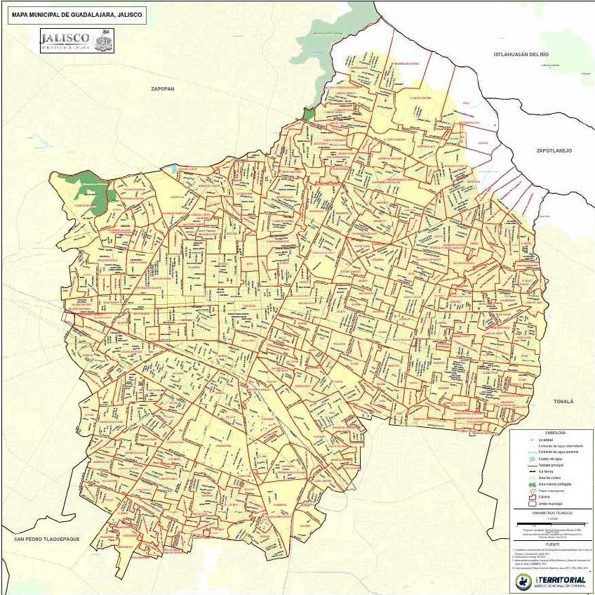
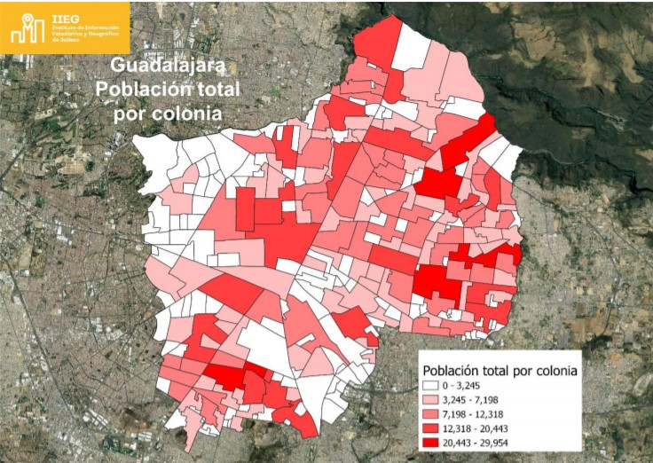
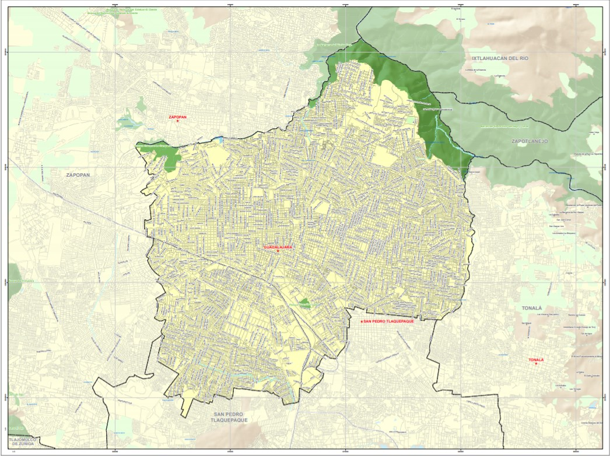

```{r setup, include=FALSE}
knitr::opts_chunk$set(echo = TRUE, warning = FALSE, 
                      message = FALSE, fig.align = "center")
```

# Diseño de la encuesta

## Objetivo de la encuesta

El objetivo de la presente encuesta es estimar la cantidad de perros que existen en situación de calle dentro de la ciudad de Guadalajara, así como algunas de las características de los canes: sexo, edad, signos de maltrato, enfermedades, embarazos, entre otras.

## Población objetivo

La encuesta está dirigida de manera indirecta a todos los perros en situación de calle dentro de la ciudad de Guadalajara. Podemos definir perros callejeros como aquellos a los que al momento de ser tomados en la muestra no se encuentren en control directo de algún humano dentro de un espacio público.

## Cobertura geográfica

La encuesta está diseñada para mostrar resultados para Guadalajara a partir de la división entre colonias y calles de la ciudad. 

## Marco de la encuesta

El diseño de la muestra se caracteriza por ser probabilístico; en consecuencia, los resultados obtenidos de la encuesta se generalizan a toda la población callejera canina en Guadalajara, a su vez, es multietápico y estratificado, donde las unidades de selección son inicialmente las colonias, posteriormente las calles y finalmente el horario.

### Unidades Primarias de Muestreo (UPM)

Inicialmente, se construye el conjunto de UPM que cubrirá el territorio de la ciudad de Guadalajara. Las unidades primarias de muestreo están constituidas por colonias con características diferenciadas de acuerdo a su población humana. Estas serán seleccionadas mediante muestreo aleatorio simple sin reemplazo.

De acuerdo con la página de [datos del gobierno de Jalisco](https://datos.jalisco.gob.mx/dataset/informacion-sociodemografica-por-colonia-area-metropolitana-de-guadalajara-jalisco), Guadalajara cuenta con 584 colonias.



### Estratificación

Una vez que tenemos nuestro conjunto de UPM, estas se agrupan considerando sus características similares, en este caso la cantidad de habitantes humanos en estas colonias. 



### Unidades Secundarias de Muestreo

Posteriormente, vamos a seleccionar algunas calles mediante muestreo aleatorio simple sin reemplazo de las colonias que resultaron elegidas anteriormente para realizar nuestro muestreo. 



### Unidades Terciarias de Muestro

Finalmente, vamos a seleccionar mediante muestro aleatorio simple sin reemplazo el horario en el que se levantará la muestra para cada una de las calles seleccionadas con anterioridad. Estos horarios pueden ser como sigue: 00:00-06:00, 06:00-12:00, 12:00-18:00 o 18:00-00:00. 

## Tamaño de la muestra

Para determinar el tamaño necesario de nuestra muestra vamos a utilizar la siguiente [fórmula](https://www.researchgate.net/figure/Figura-2-Calculo-del-tamano-de-la-muestra_fig2_282769507):

$$
\text{n} = \frac{N \cdot Z^2 \cdot \sigma^2}{(N-1) \cdot \epsilon^2 + \sigma^2 \cdot Z^2}
$$

con

- Z -> valores en la normal estándar

- $\sigma$ -> desviación estándar

- $\epsilon$ -> error que podemos permitir

Para la presente encuesta vamos a utilizar un intervalo de confianza del 90%, lo que representa un valor para Z de 1.645. Además, vamos a permitir un error del +/-5% y como no hemos realizado ninguna encuesta hasta el momento, entonces vamos a utilizar un desviación estándar de .5 para garantizar que nuestro tamaño de la muestra sea suficiente.

Si tenemos una cantidad de 584 colonias, entonces nuestro cálculo sería así:

```{r}
N <- 584
Z <- 1.645
sigma <- .5
error <- .05

n1 <- (N*Z^2*sigma^2)/((N-1)*error^2 + sigma^2*Z^2)
```

De esta manera, debemos seleccionar alrededor de `r round(n1,0)` colonias.

Para el caso de la cantidad de calles que debemos seleccionar vamos a tomar un [total](https://es.wikipedia.org/wiki/Urbanismo_de_Guadalajara_(M%C3%A9xico)) de 17,200 calles para toda la ciudad de Guadalajara. Para simplificar los cálculos vamos a tomar el promedio de calles por colonia como $\frac{17,200}{584} \approx 30$ calles. Al igual que determinamos el tamaño estimado de muestra que debemos seleccionar vamos a hacer lo correspondiente:

```{r}
N <- 17200
Z <- 1.645
sigma <- .5
error <- .05

n2 <- (N*Z^2*sigma^2)/((N-1)*error^2 + sigma^2*Z^2)
```

De esta manera, debemos seleccionar alrededor de `r round(n2,0)` calles en total, o `r ceiling(n2/n1)` calles por cada colonia.

## Levantamiento de la encuesta

La manera en que los encuestadores harán el levantamiento de los datos es mediante observación. Es decir, a cada uno de los encuestadores les será asignada la colonia, la calles y el horario en el que tendrán que estar colocados para observar y recolectar información sobre los perritos callejeros vistos por la calle. Para ello tendrá un mapa detallado de la calle que deben recorrer durante ese tiempo en busca de caninos. 

De esta forma, cada encuestador deberá recolectar información como la ubicación exacta donde fue visto el perrito, la fecha y hora, sexo (macho, hembra), grupo etario (joven, adulto, viejo), tamaño corporal (chico, mediano, grande), signos de maltrato, enfermedades visibles, color.

## Costo estimado

De acuerdo con [*talent*](https://mx.talent.com/salary?job=encuestador), un encuestador en México cobra máximo alrededor de $31.89 pesos mexicanos por hora. Para la presente encuesta y siguiendo los resultado anteriores necesitamos hacer el análisis para 266 calles en periodos de 4 horas. Por lo que requerimos de 1064 horas de trabajo. Además, tomando en cuenta los traslados que deben realizar los encuestadores para llegar a su lugar asignado, vamos a asignar un apoyo de viáticos de \$50 pesos mexicanos por encuestador. Por simplificar, vamos a determinar que es necesario 1 encuestador por calle a levantar la encuesta.

Así, nuestra función de costo está dada por:

$$
\text{Costo} = 50 \cdot x + 31.89 \cdot 4 \cdot x
$$

Con x como la cantidad de calles en las que se tomará la muestra. Así, nuestro costo de la encuesta es de aproximadamente $`r format(50*266 + 31.89*4*266, scientific = F, big.mark = ',')` pesos mexicanos. 

## Estimador del total

Como el objetivo de la encuesta lo plantea, buscamos estimar la cantidad total de perros callejeros en situación de calle, para ello proponemos nuestro estimador:

$$
\begin{split}
\hat{T} & = \sum_{k=1}^{N} \frac{x_k}{\pi_{k}} \mathbb{I}_S(x_k)\\
        & = \sum_{k=1}^{N} \frac{\mathbb{I}_S(x_k)}{\pi_{k}} \mathbb{I}_S(x_k)\\
        & = \sum_{k=1}^{N} \frac{\mathbb{I}_S(x_k)}{\pi_{k}}\\
        & = \sum_{k=1}^{N} \frac{\mathbb{I}_S(x_k)}{\mathbb{P}(x_k \in S)}\\ 
        & = \sum_{k=1}^{N} \frac{\mathbb{I}_S(x_k)}{\mathbb{P}(\text{Colonia}) \cdot \mathbb{P}(\text{Calle} | \text{Colonia}) \cdot \mathbb{P}(Horario | Calle)}\\
\end{split}
$$

Notemos que nuestras $x_k$ como en realidad son una variable de conteo, entonces podemos convertirla en una indicadora que depende si se encuentran en la muestra o no, es decir, si fue observado el perrito. 

Como no tenemos el número exacto de calles por colonia, entonces vamos a suponer su independencia al tomar en cuenta que tenemos la misma cantidad de calles en cada colonia. Además, utilizando nuestro datos obtenido anteriormente, podemos estimar las siguientes probabilidades:

$$
\begin{split}
\hat{T} & = \sum_{k=1}^{N} \frac{\mathbb{I}_S(x_k)}{\mathbb{P}(\text{Colonia}) \cdot \mathbb{P}(\text{Calle} | \text{Colonia}) \cdot \mathbb{P}(Horario | Calle)}\\
        & = \sum_{k=1}^{N} \frac{\mathbb{I}_S(x_k)}{\mathbb{P}(\text{Colonia}) \cdot \mathbb{P}(\text{Calle}) \cdot \mathbb{P}(Horario)}\\
        & = \sum_{k=1}^{N} \frac{\mathbb{I}_S(x_k)}{\frac{185}{584} \cdot \frac{2}{30} \cdot \frac{1}{4}}\\
        & = \sum_{k=1}^{N} \frac{\mathbb{I}_S(x_k)}{\frac{370}{70,080}}\\
        & = \frac{70,080}{370} \sum_{k=1}^{N}{\mathbb{I}_S(x_k)}\\
        & = \frac{7,008}{37} \sum_{k=1}^{N}{\mathbb{I}_S(x_k)}\\
\end{split}
$$

Además, si suponemos que encontraremos en nuestra información que vamos a tener valores faltantes en una proporción del 2% de los perritos registrados, entonces debemos hacer el ajuste:

$$
\begin{split}
\hat{T} & = \frac{7,008}{37} \sum_{k=1}^{N}{\mathbb{I}_S(x_k)}\\
        & = \frac{1}{1-.02} \frac{7,008}{37} \sum_{k=1}^{N}{\mathbb{I}_S(x_k)}\\
        & = \frac{1}{.98} \frac{7,008}{37} \sum_{k=1}^{N}{\mathbb{I}_S(x_k)}\\
        & = \frac{50}{49} \frac{7,008}{37} \sum_{k=1}^{N}{\mathbb{I}_S(x_k)}\\
\end{split}
$$

# Base de datos simulada

Para tener una idea más precisa de cómo esperamos que funcione nuestra encuesta y cómo se verían nuestros datos, entonces vamos a simular lo datos de la misma. Por facilidad, todo será con variables numéricas.

```{r}
colonias <- 1:584
calle <- 1:30
horario <- 1:4
sexo <- 1:2
grupo_etario <- 1:3
tamano <- 1:3
maltrato <- 1:2
enfermedades <- 1:2
color <- 1:10 
```

Supongamos que se observaron un total de 225 perros durante todo el tiempo que se estuvo tomando la muestra. De esta manera, nuestra base de datos se vería de la siguiente forma:

```{r}
library(tidyverse)

colonias_muestra <- sample(colonias, 185, replace = F)
colonias_sim <- NULL
calle_sim <- NULL
horario_sim <- NULL
for (i in colonias_muestra) {
    calle_muestra <- sample(calle,2,replace = F)
    for (k in calle_muestra) {
        colonias_sim <- append(colonias_sim,i)
        calle_sim <- append(calle_sim,k)
        horario_sim <- append(horario_sim,sample(horario,1))
    }
}

data <- 
    data.frame(colonia = colonias_sim,
           calle = calle_sim,
           horario = horario_sim,
           sexo = sample(sexo, length(colonias_sim), replace = T),
           grupo_etario = sample(grupo_etario,
                                 length(colonias_sim), 
                                 replace = T),
           tamano = sample(tamano, length(colonias_sim), 
                           replace = T),
           maltrato = sample(maltrato, length(colonias_sim),
                             replace = T),
           enfermedades = sample(enfermedades,
                                 length(colonias_sim), 
                                 replace = T),
           color = sample(color, length(colonias_sim), 
                          replace = T))
falta <- as.data.frame(matrix(NA,
                              ceiling(nrow(data)*.02),
                              ncol(data)))
names(falta) <- names(data)

data <- rbind(data,falta)

data_muestra <- sample_n(data, 225)
```

Nuestra información se ve de la siguiente manera:

```{r}
library(kableExtra)
head(data_muestra) %>%
    kable()
tail(data_muestra) %>%
    kable()
```

## Estimación del total

De acuerdo con la información simulada, podemos utilizar nuestro estimador para calcular la cantidad total de perritos callejeros en Guadalajara:

```{r}
suma <-
    data_muestra %>%
    na.omit() %>%
    nrow()
total_est <- (7008/37)*suma
```

Así, nuestro cantidad total estimada de perritos callejeros en toda la ciudad de Guadalajara es de `r format(total_est, scientific = F, big.mark = ',')` caninos.

# Referencias


